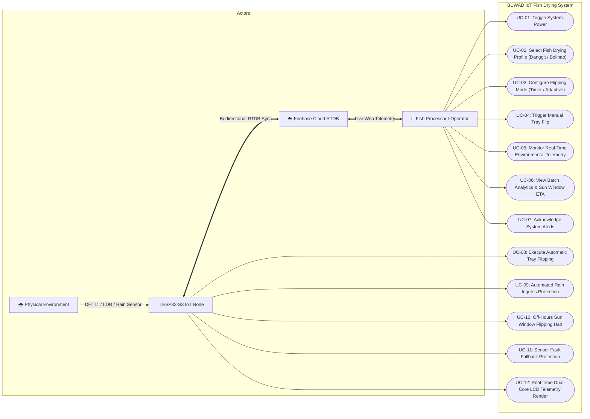
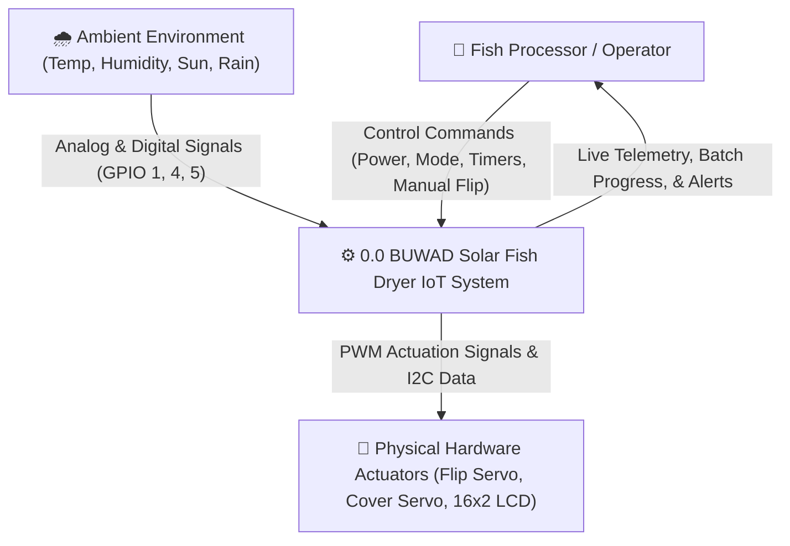
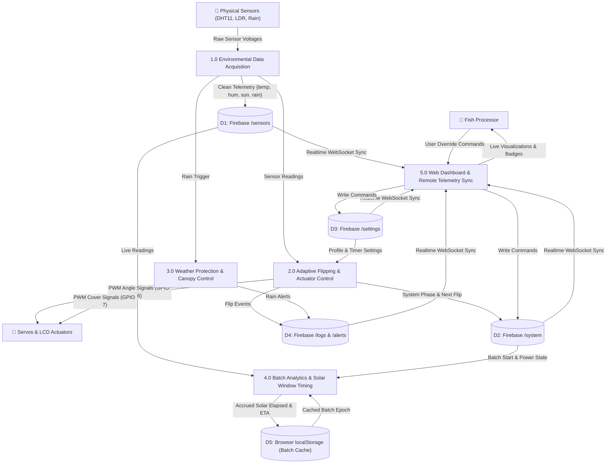
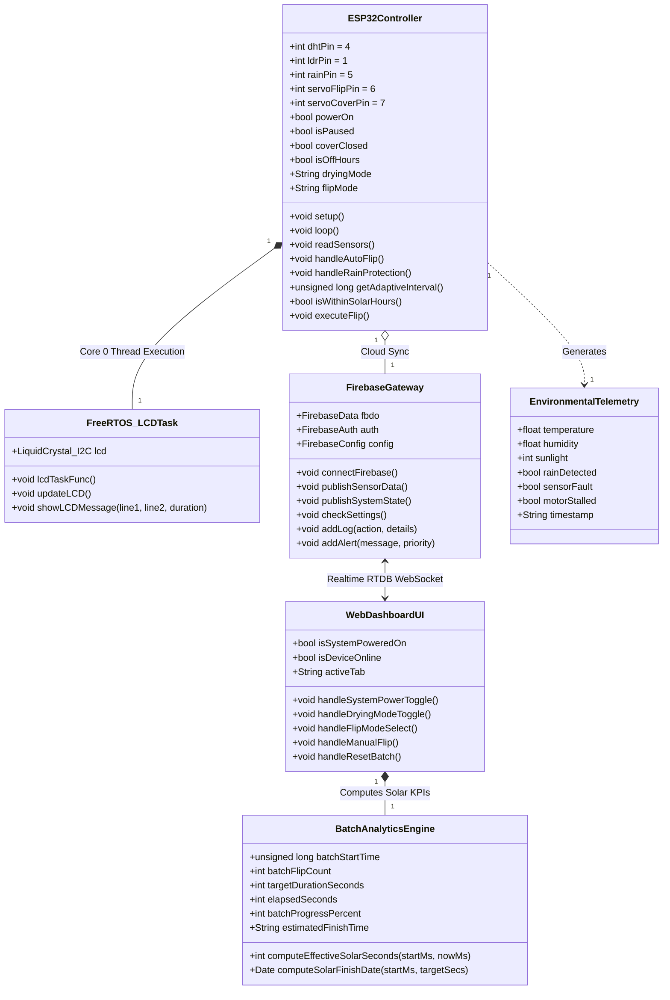

# WEEK 3: SYSTEM ANALYSIS PHASE DELIVERABLE
**Project Title:** BUWAD: Automated Solar-Powered Fish Drying System with IoT Monitoring and Protective Mechanism  
**Target Hardware:** ESP32-S3 DevKitC-1 (Dual-Core 240MHz, FreeRTOS, WiFi)  
**Target Software:** React 18 (Vite, Tailwind, Framer Motion) + Firebase Realtime Database (RTDB)  
**Submission Date:** September 1, 2026  

---

## 1. USE CASE DIAGRAM & SPECIFICATIONS

### 1.1 Use Case Diagram (UML)

---

### 1.2 Detailed Use Case Descriptions

#### **UC-01: Toggle System Power & Session Management**
* **Primary Actor:** Fish Processor / Operator
* **Pre-conditions:** Web application loaded; ESP32-S3 connected to WiFi/Firebase.
* **Post-conditions:** System state written to Firebase RTDB `/system/powerOn`; hardware actuators enabled/disabled.
* **Main Success Scenario:**
  1. Operator clicks "Turn On" on Dashboard.
  2. Web app updates `batchStartTime` in `localStorage` and publishes `powerOn: true` to Firebase `/system`.
  3. ESP32-S3 receives state update via stream callback on Core 1.
  4. ESP32 initializes sensor loops, flips tray to baseline $0^\circ$, opens protective cover, and logs `SYSTEM_ONLINE`.
* **Alternative Flows:**
  * *Device Offline:* Web dashboard flags `ESP32 OFFLINE` banner and disables actuation buttons.

---

#### **UC-02: Select Fish Drying Profile**
* **Primary Actor:** Fish Processor / Operator
* **Pre-conditions:** System powered on.
* **Post-conditions:** `/settings/dryingMode` updated to `"danggit"` or `"bolinao"`; batch timer resets automatically.
* **Main Success Scenario:**
  1. Operator selects **Danggit** (thick fillet) or **Bolinao** (small mass).
  2. Web app commits profile change to Firebase `/settings/dryingMode` and triggers `batchReset: true`.
  3. Target full sun drying period sets dynamically (Danggit: 12.0h / 1–2 days; Bolinao: 7.0h / 1 day).
  4. ESP32-S3 adjusts baseline interval timer (`15s` demo / profile default) and updates LCD Line 1 (`DAN` or `BOL`).

---

#### **UC-03: Configure Flipping Mode**
* **Primary Actor:** Fish Processor / Operator
* **Pre-conditions:** System powered on.
* **Post-conditions:** Flip algorithm configured to `"timer"` (fixed interval) or `"environment"` (sensor-driven).
* **Main Success Scenario:**
  1. Operator selects **Environment-Based (Sensor-Driven)**.
  2. ESP32-S3 activates the **Smart Solar-Adaptive Algorithm**:
     * **Peak Solar ($\ge 70\%$ Sun, $\ge 32^\circ\text{C}$):** $0.7\times$ accelerated interval (min 5s) to avoid surface case-hardening.
     * **Moderate Solar (40–70% Sun):** $1.0\times$ standard interval.
     * **Low Sun / High Humidity ($<40\%$ Sun, $>75\%$ RH):** $1.4\times$ energy-saving interval.

---

#### **UC-09: Automated Rain Ingress Protection**
* **Primary Actor:** ESP32-S3 Microcontroller / Physical Environment
* **Pre-conditions:** System powered on; rain sensor pin GPIO 5 goes `HIGH` (conductive bridging).
* **Post-conditions:** Protective canopy servo (GPIO 7) actuates to $90^\circ$ (closed); flips halted; alert dispatched.
* **Main Success Scenario:**
  1. Rain detected on digital capacitive sensor.
  2. Firmware halts flip timer and immediately closes canopy servo.
  3. ESP32 pushes high-priority alert to `/alerts` and updates LCD to `"RAIN DETECTED! / Cover Closed"`.
  4. When rain sensor reads `LOW` (rain cleared), canopy opens automatically to $0^\circ$ and drying resumes.

---

#### **UC-10: Off-Hours Sun Window Flipping Halt**
* **Primary Actor:** ESP32-S3 Firmware (NTP Clock / Sunlight Logic)
* **Pre-conditions:** Local clock outside 7:00 AM – 4:00 PM (16:00) solar window.
* **Post-conditions:** Tray servo halts; elapsed batch timer freezes; LCD shows `[OFF-HOURS]`.
* **Main Success Scenario:**
  1. Real-time clock hits 4:00 PM (16:00 PST).
  2. ESP32 enters `off_hours` phase to prevent dew accumulation and humidity reabsorption.
  3. Dashboard and LCD show `RESUMES 7:00 AM`.
  4. At 7:00 AM the next morning, active flipping and batch elapsed timer resume automatically.

---

## 2. DATA FLOW DIAGRAMS (DFD)

### 2.1 Context Level 0 DFD (System Overview)

---

### 2.2 Level 1 DFD (Subsystem Decomposition)

---

## 3. CLASS DIAGRAM (UML SOFTWARE ARCHITECTURE)

---

## 4. PROCESS & DATA STORE MATRIX

| Process ID | Process Name | Inputs | Outputs | Data Stores Accessed | Description |
| :--- | :--- | :--- | :--- | :--- | :--- |
| **1.0** | Data Acquisition | Raw Sensor Signals (GPIO 1, 4, 5) | Filtered Telemetry | `D1: /sensors` | Reads DHT11, LDR, and Rain sensor every 1000ms with fault-detection. |
| **2.0** | Adaptive Flipping | Telemetry, Timer Settings | Servo PWM Pulse, Next Flip ETA | `D2: /system`, `D3: /settings`, `D4: /logs` | Dynamic algorithm adapting flip frequency based on solar intensity (0.7x to 1.4x). |
| **3.0** | Rain Ingress Protection | Digital Rain Level | Cover Servo PWM (0°/90°) | `D2: /system`, `D4: /alerts` | Automatically seals drying chamber within 200ms of rain detection. |
| **4.0** | Batch Solar Accounting | Batch Epoch, Current Local Time | Solar Elapsed, Multi-day ETA | `D5: localStorage`, `D2: /system` | Accumulates drying time strictly between 7:00 AM – 4:00 PM; holds during off-hours. |
| **5.0** | Web Telemetry & Control | User Clicks, Cloud Telemetry | UI Displays, Control Writes | `D1`, `D2`, `D3`, `D4`, `D5` | Responsive React interface for monitoring and manual override actuation. |
