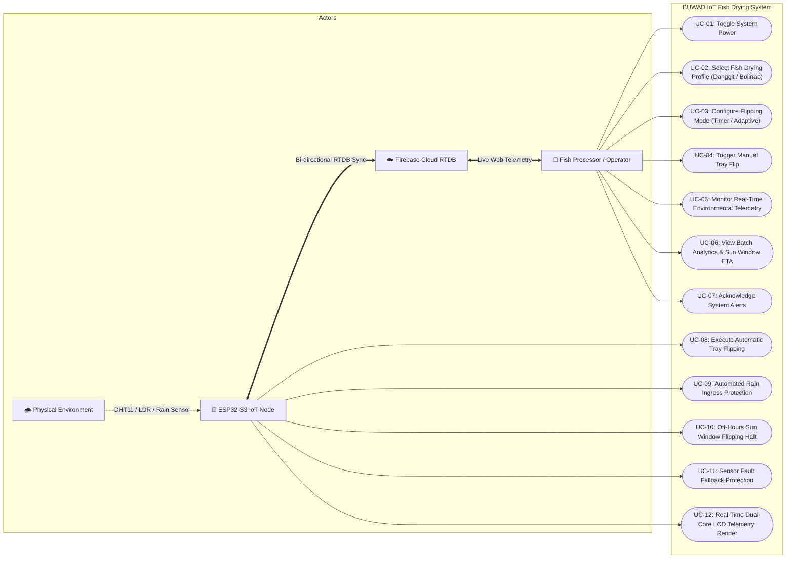
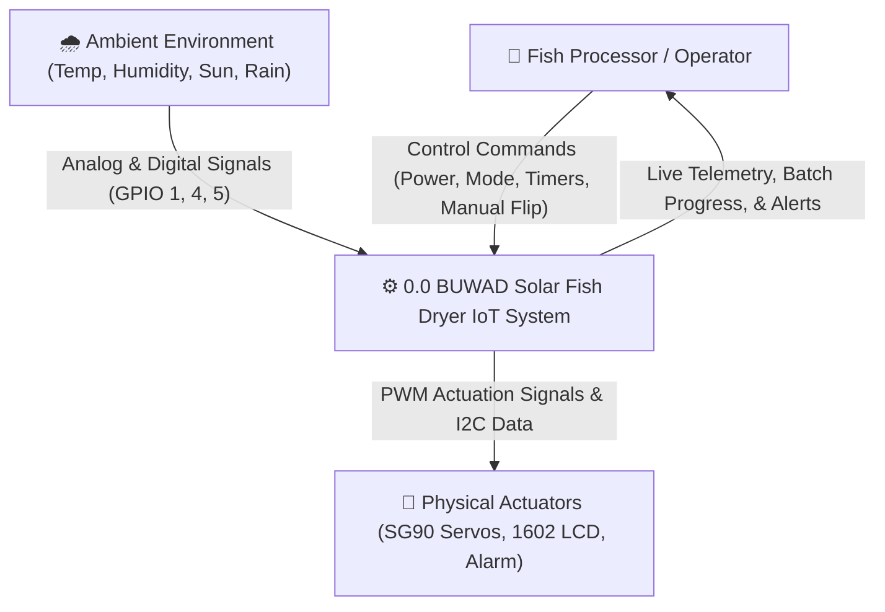
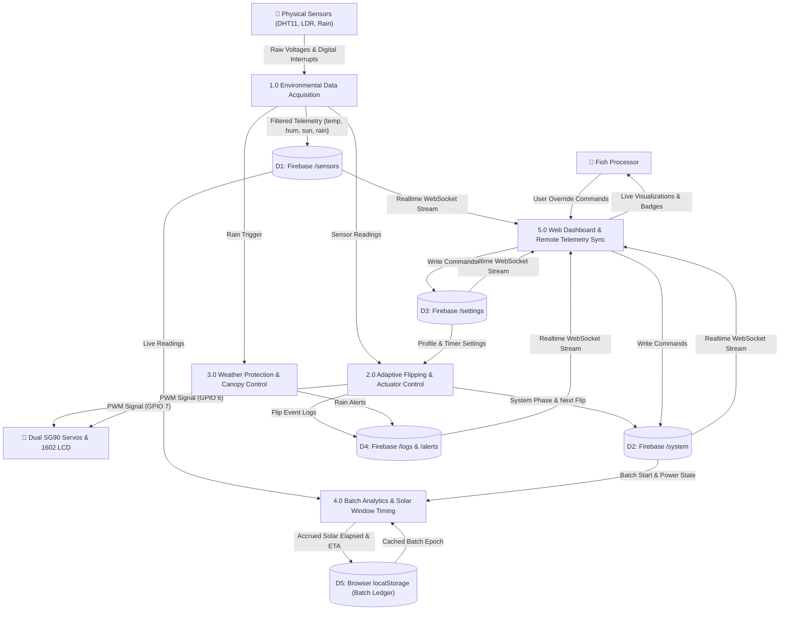
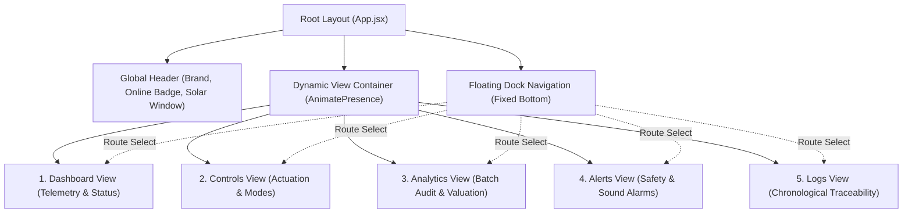
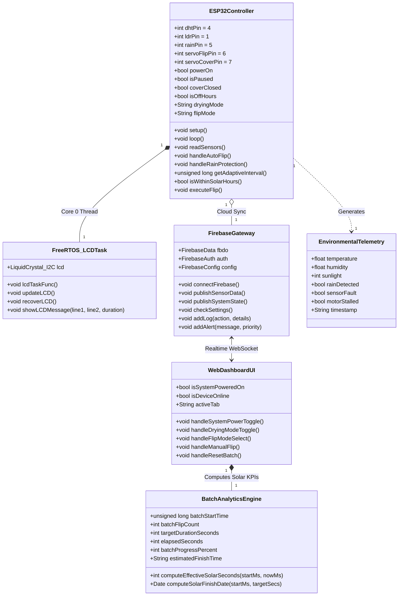
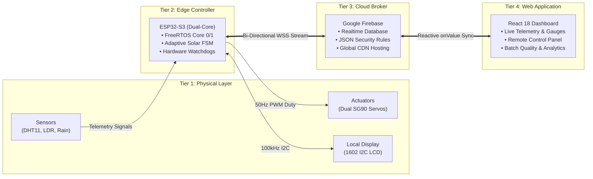
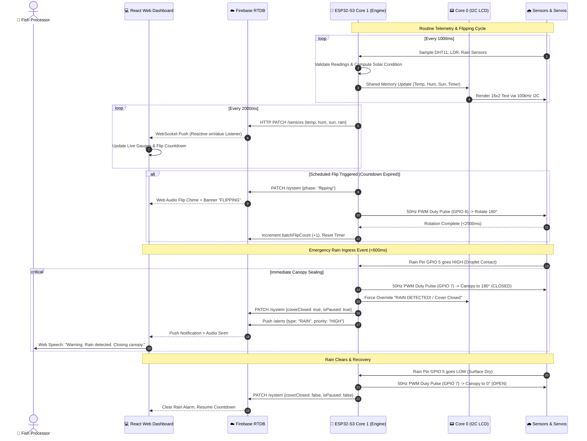

# BUWAD: Automated Solar Fish Drying System with IoT Monitoring and Protective Mechanism
## Master Technical & Architectural System Documentation
**Project Title:** BUWAD: Automated Solar-Powered Fish Drying System with IoT Monitoring and Protective Mechanism  
**Academic Degree:** Bachelor of Science in Computer Science (BSCS Capstone Thesis)  
**Institution:** University of Southern Philippines Foundation (USPF) — College of Computer Studies, Cebu City, Philippines  
**Authors:** Jonathan II T. Jumao-as & Andrian Jay J. Dimpas  
**Research Adviser:** Boi Archievald Ranay  
**Thesis Panel Evaluators:** Gian Carlo Cataraja & Marie Joy Morano-Sanchez  
**Live Production URL:** [https://buwad-iot-dashboard.web.app](https://buwad-iot-dashboard.web.app)  
**Compilation Date:** October 2026 • **Documentation Version:** 2.0 (Consolidated Master Deliverable)  

---

## 📑 Table of Contents
1. [Executive Summary & Problem Domain](#1-executive-summary--problem-domain)
2. [Part 1: System Analysis & Operational Requirements](#2-part-1-system-analysis--operational-requirements)
   - 2.1 [Actors & High-Level System Scope](#21-actors--high-level-system-scope)
   - 2.2 [UML Use Case Diagram & Detailed Specifications](#22-uml-use-case-diagram--detailed-specifications)
   - 2.3 [Data Flow Diagrams (Context Level 0 & Level 1 DFD)](#23-data-flow-diagrams-context-level-0--level-1-dfd)
   - 2.4 [Process & Data Store Matrix](#24-process--data-store-matrix)
   - 2.5 [Requirements Traceability Matrix (RTM)](#25-requirements-traceability-matrix-rtm)
3. [Part 2: System Design & Database Architecture](#3-part-2-system-design--database-architecture)
   - 3.1 [Design System & Visual Tokens](#31-design-system--visual-tokens)
   - 3.2 [Navigation & Component Hierarchy](#32-navigation--component-hierarchy)
   - 3.3 [Functional Web Modules (Dashboard, Controls, Analytics, Alerts, Logs)](#33-functional-web-modules)
   - 3.4 [Database Architecture & Entity-Relationship Diagram (ERD)](#34-database-architecture--entity-relationship-diagram-erd)
   - 3.5 [Cloud Data Dictionary (Firebase RTDB Schema)](#35-cloud-data-dictionary-firebase-rtdb-schema)
   - 3.6 [UML Software Class Diagram](#36-uml-software-class-diagram)
4. [Part 3: System Architecture & Technology Stack](#4-part-3-system-architecture--technology-stack)
   - 4.1 [Decoupled 4-Tier Topology](#41-decoupled-4-tier-topology)
   - 4.2 [Tier 1: Physical Layer & Hardware Pinout Specifications](#42-tier-1-physical-layer--hardware-pinout-specifications)
   - 4.3 [Power System & Rocker Switch Wiring](#43-power-system--rocker-switch-wiring)
   - 4.4 [Tier 2: Embedded Dual-Core Firmware Architecture (ESP32-S3 FreeRTOS)](#44-tier-2-embedded-dual-core-firmware-architecture-esp32-s3-freertos)
   - 4.5 [Tier 3: Cloud Broker & Persistence Layer (Google Firebase)](#45-tier-3-cloud-broker--persistence-layer-google-firebase)
   - 4.6 [Tier 4: Client Application Layer (React 18 Single-Page App)](#46-tier-4-client-application-layer-react-18-single-page-app)
   - 4.7 [End-to-End System Sequence Diagram](#47-end-to-end-system-sequence-diagram)
   - 4.8 [Comprehensive Technology Stack Matrix](#48-comprehensive-technology-stack-matrix)
5. [Part 4: Defense Alignment, KPIs & Fail-Safe Contingencies](#5-part-4-defense-alignment-kpis--fail-safe-contingencies)
   - 5.1 [Measurable Outcomes Table & Quantitative KPIs](#51-measurable-outcomes-table--quantitative-kpis)
   - 5.2 [Fail-Safe & Contingency Operations Matrix](#52-fail-safe--contingency-operations-matrix)
   - 5.3 [Defense Panel Comments & Revision Compliance](#53-defense-panel-comments--revision-compliance)
6. [Part 5: System Operations & User Manual](#6-part-5-system-operations--user-manual)

---

## 1. Executive Summary & Problem Domain

The artisanal dried fish industry in coastal Philippine municipalities (e.g., Bantayan Island, Cebu, and Western Visayas) forms a primary livelihood for small-scale coastal fisherfolk. However, traditional open-air sun drying operations remain vulnerable to environmental unpredictability:

* **Post-Harvest Spoilage Losses:** Unpredicted rainfall and overnight dew accumulation cause microbial decomposition, resulting in a **30%–40% loss rate per batch** (Bureau of Fisheries and Aquatic Resources, BFAR).
* **Labor Overhead:** Laborers must manually invert each fish rack every 30 to 60 minutes across 7 to 12 solar hours to achieve balanced moisture evaporation, incurring significant operational overhead.
* **Surface Case-Hardening & Quality Degradation:** Over-exposure during peak midday solar irradiance causes outer skin drying before internal moisture can migrate out, trapping moisture and causing deep-tissue spoilage.

The **BUWAD** system solves these challenges by combining an **ESP32-S3 dual-core microcontroller**, **dual TowerPro SG90 servo motor actuators**, **climate sensors (DHT11, LDR, Capacitive Rain)**, and a **cloud-synchronized React dashboard**. The system automates tray turning, provides emergency rain sealing in under 600ms, and freezes drying clocks during nocturnal off-hours.

---

## 2. Part 1: System Analysis & Operational Requirements

### 2.1 Actors & High-Level System Scope

```
+---------------------------------------------------------------------------------------+
|                                  SYSTEM ACTORS                                        |
+--------------------------+------------------------------------------------------------+
| Actor                    | Operational Role & Responsibilities                        |
+--------------------------+------------------------------------------------------------+
| Fish Processor / Operator| Initializes batches, loads fish, selects species profiles, |
|                          | inspects telemetry, triggers manual overrides, saves logs. |
| ESP32-S3 IoT Node        | Samples sensors, drives servo motors, updates 1602 LCD,    |
|                          | executes watchdog safety loops, synchronizes with cloud.   |
| Firebase Cloud Broker    | Brokers low-latency WebSocket data streams, holds state.   |
| Ambient Environment      | Provides temperature, humidity, sunlight, and rain drops.  |
+--------------------------+------------------------------------------------------------+
```

### 2.2 UML Use Case Diagram & Detailed Specifications



#### Detailed Use Case Specifications

* **UC-01: Toggle System Power & Session Management**
  * *Primary Actor:* Fish Processor / Operator
  * *Pre-conditions:* Web application loaded; ESP32-S3 connected to WiFi/Firebase.
  * *Post-conditions:* `/system/powerOn` updated in Firebase RTDB; hardware actuators armed/disarmed.
  * *Main Flow:* Operator clicks "Turn On". Firebase updates `powerOn: true`. ESP32-S3 receives state, moves tray to level 0°, opens canopy to 0°, and logs `SYSTEM_ONLINE`.

* **UC-02: Select Fish Drying Profile**
  * *Primary Actor:* Fish Processor / Operator
  * *Pre-conditions:* System powered on.
  * *Post-conditions:* `/settings/dryingMode` set to `"danggit"` or `"bolinao"`; batch countdown configured.
  * *Main Flow:* Operator selects **Danggit** (12.0h target) or **Bolinao** (7.0h target). System updates target solar duration and updates LCD Line 1.

* **UC-03: Configure Flipping Mode (Timer vs. Solar-Adaptive)**
  * *Primary Actor:* Fish Processor / Operator
  * *Pre-conditions:* System powered on.
  * *Post-conditions:* `/system/flipMode` set to `"timer"` or `"environment"`.
  * *Main Flow:* In **Solar-Adaptive Mode**, the ESP32 samples LDR and DHT11. Peak solar ($\ge 70\%$ Sun, $\ge 32^\circ\text{C}$, $\le 65\%$ RH) triggers an accelerated flip rhythm followed by an enforced 1-hour cooldown to prevent case-hardening.

* **UC-08: Execute Automatic Tray Flipping (TowerPro SG90 Actuation)**
  * *Primary Actor:* ESP32-S3 Microcontroller
  * *Pre-conditions:* Drying batch active; protective canopy is open; flip countdown expires.
  * *Post-conditions:* Tray rotates 180°; flip counter increments by +1; web audio chime sounds.
  * *Main Flow:* Core 1 sends 50Hz PWM duty cycle to GPIO 6. Servo rotates tray smoothly over ~2.1 seconds.

* **UC-09: Automated Rain Ingress Protection (<600ms)**
  * *Primary Actor:* ESP32-S3 Microcontroller / Physical Environment
  * *Pre-conditions:* System powered on; rain sensor pin GPIO 5 goes `HIGH`.
  * *Post-conditions:* Canopy servo (GPIO 7) sweeps to 180° (sealed); flips paused; alert dispatched.
  * *Main Flow:* Raindrop bridges capacitive board. Core 1 halts flip countdown and closes canopy within <600ms. Voice announcement triggers: *"Warning: Rain detected. Protective canopy is closing."* When dry, canopy reopens to 0° and drying resumes.

* **UC-10: Off-Hours Sun Window Flipping Halt (4:00 PM – 7:00 AM)**
  * *Primary Actor:* ESP32-S3 Firmware (NTP Clock Sync)
  * *Pre-conditions:* Local clock hits 16:00 (4:00 PM PST).
  * *Post-conditions:* Flipping halts; countdown pauses; LCD displays `[NIGHT HOLD] Resumes 7:00 AM`.
  * *Main Flow:* Prevents night-time dew condensation and conserves battery. At 7:00 AM next day, countdown resumes.

---

### 2.3 Data Flow Diagrams (Context Level 0 & Level 1 DFD)

#### Context Level 0 DFD


#### Level 1 DFD (Subsystem Decomposition)


---

### 2.4 Process & Data Store Matrix

| Process ID | Process Name | Inputs | Outputs | Data Stores Accessed | Description |
| :--- | :--- | :--- | :--- | :--- | :--- |
| **1.0** | Data Acquisition | Raw Sensor Signals (GPIO 1, 4, 5) | Filtered Telemetry | `D1: /sensors` | Samples DHT11, LDR, and Rain Sensor every 1,000ms with a 5-sample median filter. |
| **2.0** | Adaptive Flipping | Telemetry, Timer Settings | Servo PWM Pulse (GPIO 6) | `D2: /system`, `D3: /settings`, `D4: /logs` | Computes flip timing based on species preset or peak solar environmental index. |
| **3.0** | Rain Ingress Protection | Digital Rain Level (GPIO 5) | Canopy PWM Pulse (GPIO 7) | `D2: /system`, `D4: /alerts` | Automatically seals protective acrylic canopy within <600ms of raindrop contact. |
| **4.0** | Batch Solar Accounting | Batch Epoch, Current Clock | Solar Elapsed, Multi-day ETA | `D5: localStorage`, `D2: /system` | Accumulates drying time strictly between 7:00 AM – 4:00 PM; pauses during off-hours. |
| **5.0** | Web Telemetry & Control | User Clicks, Cloud Telemetry | UI Displays, Control Writes | `D1`, `D2`, `D3`, `D4`, `D5` | Responsive React interface for monitoring, manual actuation, and report generation. |

---

### 2.5 Requirements Traceability Matrix (RTM)

| Req. ID | System Functional Requirement | System Feature | Mapped Test ID | Acceptance Criteria |
| :---: | :--- | :--- | :---: | :--- |
| **FR-01** | Real-time temperature, humidity, sunlight, and rain data acquisition. | Sensor Telemetry Sync | **UAT-01** | Cloud and LCD update within <1.5s; matches physical meters within ±5%. |
| **FR-02** | Species batch initialization (Danggit 12h vs Bolinao 7h) with tray lock confirmation. | Batch Wizard | **UAT-02** | Countdown commences; latch confirmed; LCD updates species code. |
| **FR-03** | Automated 180° bilateral tray flipping via SG90 servo motor mechanism. | Automated Tray Inversion | **UAT-03** | Smooth 180° rotation without fish displacement; flip chime sounds. |
| **FR-04** | Emergency protective canopy deployment upon rain detection (<600ms). | Rain Canopy Actuation | **UAT-04** | Canopy seals shut in <600ms; voice alert triggers; drying pauses. |
| **FR-05** | Manual operator override for tray flipping and canopy toggling. | Manual Control Engine | **UAT-05** | Actuates immediately (<1s); actions logged in chronological audit log. |
| **FR-06** | Completed batch archival with PDF report printing and CSV raw data export. | Analytics & Archive | **UAT-06** | Clean PDF with USPF header; CSV exports 17 standard columns with UTF-8 BOM. |
| **FR-07** | Automatic hold of countdown and servo flipping outside 7:00 AM – 4:00 PM. | Solar Window Scheduler | **UAT-07** | Timer & flipping halt at 16:00; LCD shows `NIGHT HOLD`; resumes 07:00. |

---

## 3. Part 2: System Design & Database Architecture

### 3.1 Design System & Visual Tokens

The BUWAD web application is designed for high daylight legibility in outdoor coastal environments:

```
+-------------------------------------------------------------------------------+
|                             BUWAD DESIGN TOKENS                               |
+-------------------------------------------------------------------------------+
|  Primary Brand:    #00386D (Deep Ocean Navy - USPF Academic Authority)        |
|  Secondary Accent: #6699CC (Solar Sky Steel Blue - Interactive Elements)      |
|  Status Emerald:   #10B981 (Nominal / Active Solar Window / Passing Standard)  |
|  Status Amber:     #F59E0B (Off-Hours Hold / Warning Threshold)               |
|  Status Crimson:   #EF4444 (Rain Ingress Alarm / Critical Hazard)             |
|  Background Light: #E8EDF3 (Anti-Glare Coastal Daylight Canvas)               |
|  Background Dark:  #1A202C (Deep Midnight Slate - Low Power Night Canvas)     |
|  Typography:       Space Grotesk (Numerical Telemetry) & Inter (UI Labels)   |
|  Corner Geometry:  3xl (24px) Outer Cards • 2xl (16px) Inner Parameter Tiles   |
+-------------------------------------------------------------------------------+
```

### 3.2 Navigation & Component Hierarchy



### 3.3 Functional Web Modules

1. **Dashboard Module (`Dashboard.jsx`):**
   * Real-time climate tiles (Temperature °C, Humidity %, Sunlight %, Rain status).
   * Synchronized flip countdown clock with animated SVG progress rings.
   * Solar window banner displaying daylight status (Active Sun vs. Night Hold).
2. **Controls Module (`Controls.jsx`):**
   * Prominently highlighted `+ START NEW DRYING BATCH` modal trigger.
   * Species profile selector (Danggit 12h vs. Bolinao 7h).
   * Flipping mode toggles (Timer Mode vs. Environment-Adaptive Mode).
   * Manual override buttons (`MANUAL FLIP FISH TRAY`, `CLOSE CANOPY`, `OPEN CANOPY`).
   * 5-Step Hardware Diagnostic Self-Test.
3. **Analytics & Valuation Module (`Analytics.jsx`):**
   * Solar exposure clock computing accrued drying hours strictly between 7:00 AM – 4:00 PM.
   * Dynamic Economic ROI Calculator: computes Batch Market Value, Safeguarded Loss (₱), Labor Savings (₱ at ₱55/hr DOLE rate), and Grade A Quality Premium (+15%).
   * One-click export engines: Printable **PDF Quality Certificate** and raw **CSV Spreadsheet**.
4. **Weather Safety & Alerts Module (`Alerts.jsx`):**
   * Real-time priority alert queue (High, Medium, Low).
   * Synthetic audio siren tone and Web Speech API vocal alerts.
5. **Activity Log Module (`Logs.jsx`):**
   * Immutable audit trail recording power events, flips, rain closures, and diagnostics with telemetry snapshots.
6. **Bilingual Localization Context (`LanguageContext.jsx`):**
   * Real-time language switching between English and Cebuano-Visayan (*Binisaya*).

---

### 3.4 Database Architecture & Entity-Relationship Diagram (ERD)

```mermaid
erDiagram
    FIREBASE_ROOT ||--|| SENSORS_NODE : "contains singleton"
    FIREBASE_ROOT ||--|| SYSTEM_NODE : "contains singleton"
    FIREBASE_ROOT ||--o{ LOGS_COLLECTION : "generates push entries"
    FIREBASE_ROOT ||--o{ ALERTS_COLLECTION : "publishes push events"
    FIREBASE_ROOT ||--o{ LOCAL_BATCH_HISTORY : "aggregates into client store"

    SENSORS_NODE {
        float temperature "Chamber dry-bulb temp in °C"
        float humidity "Relative humidity in %RH"
        int sunlight "Normalized solar index 0-100%"
        boolean rainDetected "Rain sensor contact flag"
    }

    SYSTEM_NODE {
        boolean powerOn "Master operational power switch"
        boolean isPaused "User pause state"
        string dryingMode "Species protocol (danggit|bolinao)"
        string flipMode "Actuation mode (timer|environment)"
        int timerInterval "Active flip cycle (seconds)"
        int danggitTimer "Danggit interval (seconds)"
        int bolinaoTimer "Bolinao interval (seconds)"
        int batchFlipCount "Flips executed in current run"
        int64 batchStartTime "Unix epoch timestamp in ms"
        boolean isOffHours "Outside 07:00-16:00 solar window"
        string phase "active|env_cooldown|off_hours|offline"
        boolean coverClosed "Physical canopy servo state"
        boolean motorStalled "Actuator mechanical fault flag"
        boolean sensorFault "DHT11/LDR hardware fault flag"
        string lastUpdate "ESP32 heartbeat time HH:MM:SS"
    }

    LOGS_COLLECTION {
        string pushId PK "Firebase auto-generated Push key"
        string id "Unique client-side UUID or push identifier"
        int64 createdAt "Unix epoch timestamp in ms"
        string timestamp "Formatted wall time HH:MM"
        string action "Event code (AUTO_FLIP|RAIN_SHUT|etc)"
        string details "Detailed descriptive telemetry string"
        object sensorValues "Embedded snapshot (temp, hum, sun, rain)"
    }

    ALERTS_COLLECTION {
        string pushId PK "Firebase auto-generated Push key"
        string id "Unique alert record key"
        string type "Category (RAIN|SENSOR_FAULT|STALL)"
        string priority "Severity level (HIGH|MEDIUM|LOW)"
        string message "Human-readable diagnostic description"
        string timestamp "Alert trigger timestamp string"
    }

    LOCAL_BATCH_HISTORY {
        string id PK "Unique batch UUID"
        string batchNumber "Human-readable code (e.g. BATCH-20261001-01)"
        string species "Target species (Danggit|Bolinao)"
        float weightKg "Batch fresh weight in kilograms"
        int targetHours "Target solar drying duration"
        int actualMinutes "Accrued operational drying minutes"
        int flipCount "Total physical tray inversions"
        float avgTemp "Batch mean chamber temperature"
        float avgHumidity "Batch mean chamber relative humidity"
        int peakSunlight "Maximum recorded solar index %"
        float marketValue "Estimated gross market value (PHP)"
        float safeguardedLoss "Protected harvest value (PHP)"
        float laborSavings "Manual turning labor saved (PHP)"
        int rainEvents "Total rainfall protective closures"
        string compliance "PNS/BAFPS 68:2008 Grade Rating"
    }
```



---

### 3.5 Cloud Data Dictionary (Firebase RTDB Schema)

```
buwad-iot-dashboard-default-rtdb.firebaseio.com/
│
├── sensors/                 # Live environmental telemetry from ESP32 sensors
│   ├── temperature: float   # Current chamber temperature in Celsius (DHT11)
│   ├── humidity: float      # Relative air humidity percentage (DHT11)
│   ├── sunlight: int        # Solar irradiance percentage 0-100% (LDR)
│   └── rainDetected: bool   # Active rain presence on sensor surface
│
├── system/                  # Operational system state and user controls
│   ├── powerOn: bool        # Master system power state
│   ├── isPaused: bool       # Operational pause hold
│   ├── dryingMode: string   # "danggit" | "bolinao"
│   ├── flipMode: string     # "timer" | "environment"
│   ├── timerInterval: int   # Current cycle interval in seconds
│   ├── danggitTimer: int    # Danggit timer setting in seconds
│   ├── bolinaoTimer: int    # Bolinao timer setting in seconds
│   ├── batchFlipCount: int  # Cumulative flips executed in current batch
│   ├── batchStartTime: int  # Epoch timestamp (ms) of batch initiation
│   ├── isOffHours: bool     # True outside 7:00 AM - 4:00 PM solar window
│   ├── phase: string        # "active" | "env_cooldown" | "off_hours" | "offline"
│   ├── coverClosed: bool    # Current physical canopy servo state
│   ├── motorStalled: bool   # Servo mechanical timeout fault flag
│   ├── sensorFault: bool    # Sensor disconnection / NaN fault flag
│   └── lastUpdate: string   # System heartbeat timestamp "HH:MM:SS"
│
├── logs/                    # Chronological audit log event feed (Push IDs)
│   └── [pushId]/
│       ├── id: string       # Unique log entry identifier
│       ├── createdAt: int   # Epoch millisecond timestamp
│       ├── timestamp: string# Formatted wall clock time "HH:MM"
│       ├── action: string   # "AUTO_FLIP" | "RAIN_PROTECTION" | "DIAGNOSTICS"
│       ├── details: string  # Event description with telemetry parameters
│       └── sensorValues: obj# Snapshot of {temp, hum, sun, rain}
│
└── alerts/                  # Active emergency notification feed (Push IDs)
    └── [pushId]/
        ├── type: string     # "RAIN" | "SENSOR_FAULT" | "STALL"
        ├── priority: string # "HIGH" | "MEDIUM" | "LOW"
        ├── message: string  # Human-readable operator alert string
        └── timestamp: string# Formatted alert timestamp
```

---

### 3.6 UML Software Class Diagram



---

## 4. Part 3: System Architecture & Technology Stack

### 4.1 Decoupled 4-Tier Topology



---

### 4.2 Tier 1: Physical Layer & Hardware Pinout Specifications

```
+---------------------------------------------------------------------------------------------------+
|                                  PHYSICAL HARDWARE SPECIFICATIONS                                 |
+-------------------+------------+---------------+--------------------------------------------------+
| Component         | Pin / Port | Protocol      | Functional Purpose & Operational Boundaries      |
+-------------------+------------+---------------+--------------------------------------------------+
| DHT11 Sensor      | GPIO 4     | Single-Bus    | Measures dry-bulb temperature (0°C to 50°C) and   |
|                   |            | Digital       | relative air humidity (20% to 90% RH).           |
| LDR Sensor        | GPIO 1     | Analog (ADC1) | Converts ambient sunlight into 0%-100% index.    |
| Rain Drop Sensor  | GPIO 5     | Digital Input | Capacitive detection of raindrops. Triggers      |
|                   |            |               | immediate canopy closure in <600ms.              |
| Flip Servo        | GPIO 6     | 50Hz PWM      | Drives bilateral 180° inversion of the drying     |
| (TowerPro SG90)   |            |               | mesh tray to ensure uniform two-sided curing.    |
| Cover Servo       | GPIO 7     | 50Hz PWM      | Sweeps protective acrylic canopy (0° Open,       |
| (TowerPro SG90)   |            |               | 180° Closed) against rain and pests.             |
| LCD 1602 Display  | SDA: GPIO 8| I2C (0x27)    | Dual-line outdoor display providing local status |
| (PCF8574 Backpack)| SCL: GPIO 9| 100kHz        | without requiring mobile device access.          |
+-------------------+------------+---------------+--------------------------------------------------+
```

---

### 4.3 Power System & Rocker Switch Wiring

The system is powered by a regulated **5.0V DC / 3.0A** power adapter (or portable 2S Li-Ion pack with buck converter adjusted to 5.0V). 

To ensure safe operation and avoid back-EMF ground loops, an **SPST Rocker Switch** is installed on the **+5V positive rail**:

```
 5V/3A Power Supply (+) ──[ ROCKER SWITCH ]──┬──► ESP32-S3 "5V" Pin
                                             ├──► SG90 Servo #1 Red Wire (Flip)
                                             ├──► SG90 Servo #2 Red Wire (Canopy)
                                             └──► 1602 LCD & Sensors VCC

 5V/3A Power Supply (−) ──────────────────────┴──► COMMON GND (ESP32 GND, Servos, Sensors, LCD)
```

#### Hardware Wiring Rules:
1. **Always switch the positive wire (+5V):** Cutting GND instead can cause components to draw parasitic current through I2C and signal lines, causing chip damage.
2. **Common Ground:** All components must share a single reference ground.
3. **Decoupling Capacitor:** Place a 470µF to 1000µF 16V electrolytic capacitor across 5V and GND near the servos to absorb sudden inrush currents and prevent ESP32 brownout resets.

---

### 4.4 Tier 2: Embedded Dual-Core Firmware Architecture (ESP32-S3 FreeRTOS)

To ensure high reliability, the firmware separates display rendering from real-time control across both Xtensa LX7 cores:

* **Core 0 (`LCD_Core0` Thread):**
  * Dedicated exclusively to refreshing the I2C 1602 LCD screen every 150ms.
  * Incorporates an **Auto-Healing Bus Routine** (`recoverLCD()`) that re-initializes the PCF8574 registers every 15 seconds. This guarantees permanent immunity against electrical back-EMF spikes generated during high-torque servo rotations.
* **Core 1 (Arduino Runtime & Operational Engine):**
  * **Sensor Sampling Loop (1,000ms):** Reads DHT11, LDR, and Rain Sensor pins. Applies a 5-sample moving median filter to discard transient electrical spikes.
  * **Solar Window Filter (07:00 – 16:00 PST):** Automatically halts the drying clock and flips outside active sunlight hours.
  * **Sensor NaN Watchdog:** Flags hardware fault if DHT11 fails 5 consecutive times, falling back to a safe 60-second fixed cycle (`FALLBACK_FLIP_INTERVAL = 60000`).
  * **Servo Stall Protection:** Enforces a 3,000ms motion timeout (`MOTOR_STALL_TIMEOUT = 3000`) to prevent servo burnout in case of physical tray obstruction.
  * **WiFi Exponential Backoff:** Reconnection backoff progressively intervals from 5s up to 120s (`WIFI_RECONNECT_MAX_DELAY = 120000`).

---

### 4.5 Tier 3: Cloud Broker & Persistence Layer (Google Firebase)

* **Firebase Realtime Database (RTDB):** Low-overhead, persistent WebSocket (WSS) socket running over Port 443 with sub-100ms delta updates.
* **Security Rules (`database.rules.json`):** Strict JSON schema enforcing data types and bounds checking on physical readings (e.g. Temperature between $-10^\circ\text{C}$ and $80^\circ\text{C}$).
* **Firebase CDN Hosting:** Serves the production bundle globally with automatic SSL/TLS encryption and HTTP/2 multiplexing.

---

### 4.6 Tier 4: Client Application Layer (React 18 Single-Page App)

* **React 18 + Vite 4.5:** Ultra-fast bundling, reactive component updates via Firebase `onValue` event listeners.
* **Tailwind CSS & Vanilla CSS Design Tokens:** Responsive mobile-first interface optimized for outdoor sunlight visibility.
* **Framer Motion:** Smooth micro-animations, animated SVG telemetry gauges, and dock transitions.
* **Web Audio & Web Speech API:** Chime sounds, siren alerts, and synthetic voice announcements during emergency rain events.

---

### 4.7 End-to-End System Sequence Diagram



---

### 4.8 Comprehensive Technology Stack Matrix

```
+---------------------------------------------------------------------------------------------------------------------+
|                                              COMPLETE TECHNOLOGY STACK MATRIX                                       |
+--------------------+-----------------------+---------------+--------------------------------------------------------+
| Architectural Tier | Technology / Tool     | Version       | Technical Role & Architectural Rationale               |
+--------------------+-----------------------+---------------+--------------------------------------------------------+
| Edge Microcontroller| ESP32-S3 DevKitC-1    | Dual-Core LX7 | 240MHz hardware execution, built-in 2.4GHz Wi-Fi,     |
|                    |                       | 512KB SRAM    | dual-core FreeRTOS task separation.                   |
| Inversion Actuator | TowerPro SG90 Servo   | 9g Micro (5V) | Inverts bilateral wire mesh tray 180° on GPIO 6.       |
| Canopy Actuator    | TowerPro SG90 Servo   | 9g Micro (5V) | Deploys clear protective acrylic canopy on GPIO 7.     |
| Climate Sensors    | DHT11, LDR, Rain Board| Hardware Rev3 | Temp, Humidity, Sunlight, and capacitive rain inputs.  |
| Local Display      | 1602 Character LCD    | I2C (PCF8574) | Local outdoor status monitor operating at 100kHz I2C.  |
| Embedded Firmware  | C++ / Arduino / RTOS  | ESP-IDF 5.1   | Real-time hardware control, watchdogs, FreeRTOS tasks. |
| Embedded Toolchain | PlatformIO / VS Code  | Core 6.1.11   | Cross-platform compilation, library dependency mgmt.   |
| Cloud Database     | Firebase Realtime DB  | REST / WSS v4 | Low-latency duplex JSON state store on port 443.       |
| Cloud Hosting      | Firebase Hosting      | Global Anycast| Google Cloud global CDN with automated SSL termination.|
| Frontend Framework | React.js              | 18.2.0        | Component-based reactive Single-Page Application.      |
| Frontend Toolchain | Vite                  | 4.5.0         | High-speed ES-module development and production bundler|
| Styling & Design   | Tailwind CSS & CSS3   | 3.3.5         | Utility-first mobile responsive design tokens.         |
| Animation Engine   | Framer Motion         | 10.16.4       | Micro-interactions, layout transitions, SVG rings.     |
| Audio & Speech     | Web Audio Synth / TTS | HTML5 Native  | Multi-frequency audio beeps & vocal alert synthesizer. |
| PDF Export Engine  | jsPDF + autoTable     | 2.5.1 / 3.5.31| Client-side generation of formal defense certificates. |
+--------------------+-----------------------+---------------+--------------------------------------------------------+
```

---

## 5. Part 4: Defense Alignment, KPIs & Fail-Safe Contingencies

### 5.1 Measurable Outcomes Table & Quantitative KPIs

Addressing recommendations by Panel Evaluator **Gian Carlo Cataraja**, the project establishes quantitative KPIs mapping each objective to a measurable target:

| Objective # | Core System Objective | Quantitative KPI / Target Threshold | Measurement Instrument | Verification Test Method |
| :---: | :--- | :--- | :--- | :--- |
| **Obj 1** | Post-Harvest Spoilage Reduction | **$\le 5.0\%$ Spoilage Rate**<br>*(Baseline traditional loss: 30%–40%)* | Calibrated digital bench scale (fresh vs. spoiled mass) | 5-batch comparison against traditional open-air racks during variable weather. |
| **Obj 2** | Drying Duration Optimization | **$\ge 25\%$ Drying Time Reduction**<br>*(Danggit $\le 12$h; Bolinao $\le 7$h)* | System epoch timer & digital moisture analyzer | Continuous moisture loss curve tracking to target 18% moisture content. |
| **Obj 3** | Moisture Uniformity | **$\le \pm 2.0\%$ Moisture Variance**<br>*(Between upper and lower fish surfaces)* | Dual-point pin moisture probe | 10 sample points per tray measured across 4 quadrants. |
| **Obj 4** | Manual Labor Overhead Reduction | **$\ge 80\%$ Reduction in Labor Minutes**<br>*(Reduced from 45 min/batch to $\le 5$ min)* | Time-motion labor study stopwatch | Recorded operator touch time per drying run. |
| **Obj 5** | Emergency Rain Closure Response | **$<600\text{ ms}$ Canopy Seal Latency**<br>*(From first droplet contact to sealed)* | High-speed digital camera & ESP32 internal micros timer | Simulated droplet drop test on capacitive board. |
| **Obj 6** | Cloud Telemetry Synchronization | **$<1,500\text{ ms}$ End-to-End Latency**<br>*(From physical change to UI display)* | NTP network packet timestamp comparison | Simulated temperature/sunlight change delta vs. UI update. |

---

### 5.2 Fail-Safe & Contingency Operations Matrix

| Hazard Condition | Detection Mechanism | Immediate Fail-Safe Action | Recovery & Fallback Protocol |
| :--- | :--- | :--- | :--- |
| **Overcast / Low Sunlight** | LDR index $<40\%$ for $>15$ minutes | Freezes solar-adaptive countdown; displays `LOW SUNLIGHT HOLD` | Automatically lengthens flip interval to 1.4×; resumes active timer when sun returns. |
| **Rain Ingress Hazard** | Capacitive board digital pin goes HIGH | Canopy servo sweeps to 180° in $<600$ms; flip motor disabled | Audio siren + voice alert; canopy reopens to 0° automatically once sensor surface dries. |
| **Motor Stall / Jamming** | Servo movement duration exceeds 3,000ms | Cuts PWM signal to servo immediately to prevent SG90 burnout | Publishes `MOTOR_STALLED` alert; allows manual mechanical inspection and reset. |
| **Sensor Disconnection / NaN** | DHT11 fails 5 consecutive reads | Activates safe fixed fallback interval (`FALLBACK_FLIP_INTERVAL = 60s`) | Flags `SENSOR_FAULT` in dashboard; displays error on LCD; continues safe operation. |
| **Power Loss / Battery Dip** | DC voltage drops below threshold | Freezes batch timer in non-volatile flash / `localStorage` | Restores batch state upon power return; resumes countdown without data loss. |
| **Wi-Fi / Internet Disconnect** | TCP socket ping timeout | Edge machine continues autonomous drying and flipping offline | Executes exponential backoff retry (5s to 120s); syncs historical logs upon reconnect. |

---

### 5.3 Defense Panel Comments & Revision Compliance

* **Marie Joy Morano-Sanchez (Panel Chair):**
  * *Figure numbers & descriptions:* All UML, DFD, and architectural diagrams include formal titles, figure numbers, and dedicated textual explanations.
  * *Unified References:* Reference list standardized into a continuous, single IEEE-formatted bibliography.
  * *Research Ethics:* Participant confidentiality strictly maintained using coded IDs (`T-01` to `T-09`).
* **Gian Carlo Cataraja (Panel Member):**
  * *Quantified problem need:* Documented empirical BFAR data (30%–40% spoilage, 45 min manual turning labor per batch).
  * *Objective KPIs:* Defined numeric thresholds (moisture variance $\le \pm 2\%$, rain latency $<600$ms, labor reduction $\ge 80\%$).
  * *Fail-safe operations:* Comprehensive contingency matrix detailing actions during motor stall, sensor drift, and power loss.

---

## 6. Part 5: System Operations & User Manual

For complete step-by-step operating instructions on physical hardware assembly, power switch wiring, batch setup, automated operations, manual overrides, reports export, care, and troubleshooting, refer to the dedicated **[USER_MANUAL.md](USER_MANUAL.md)**.
